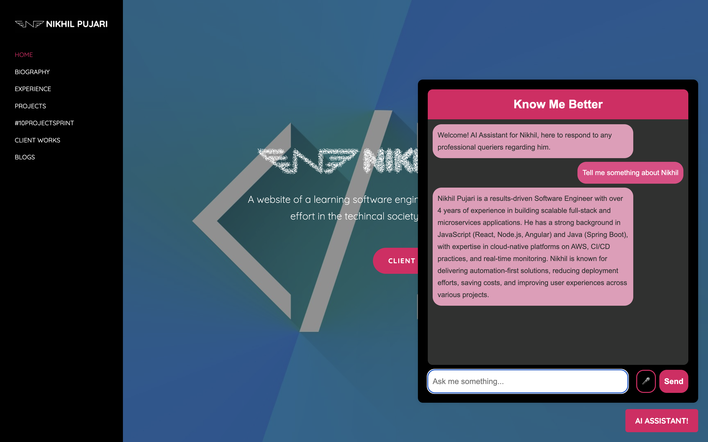
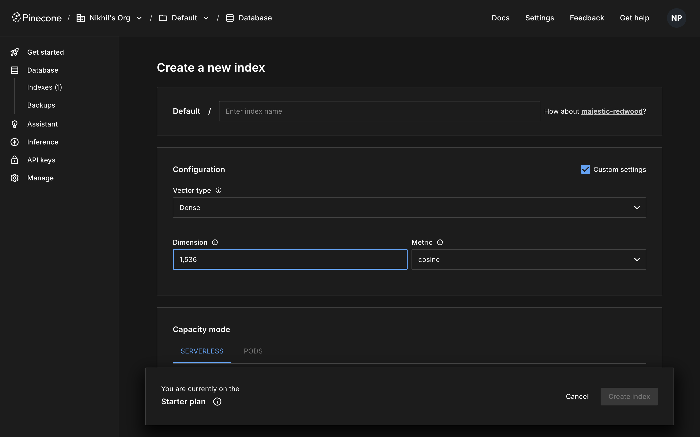
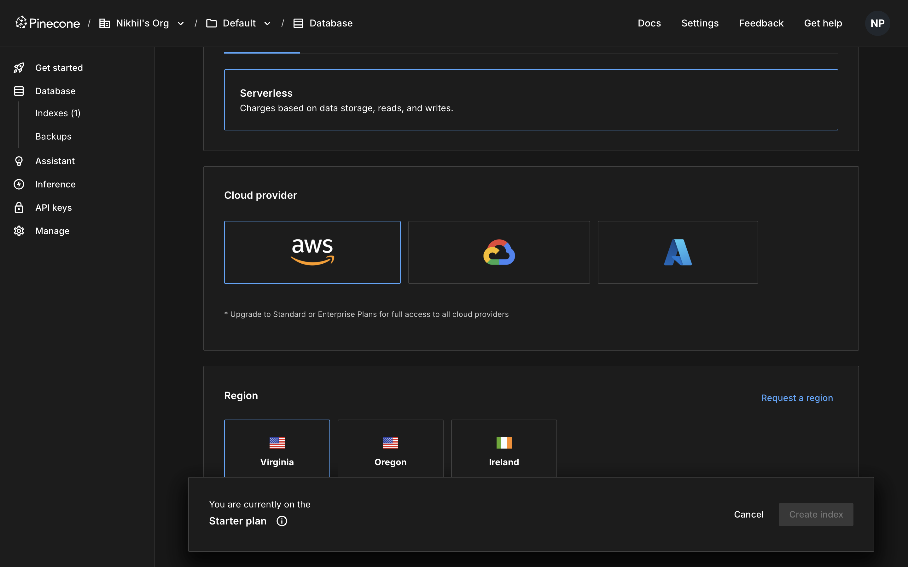
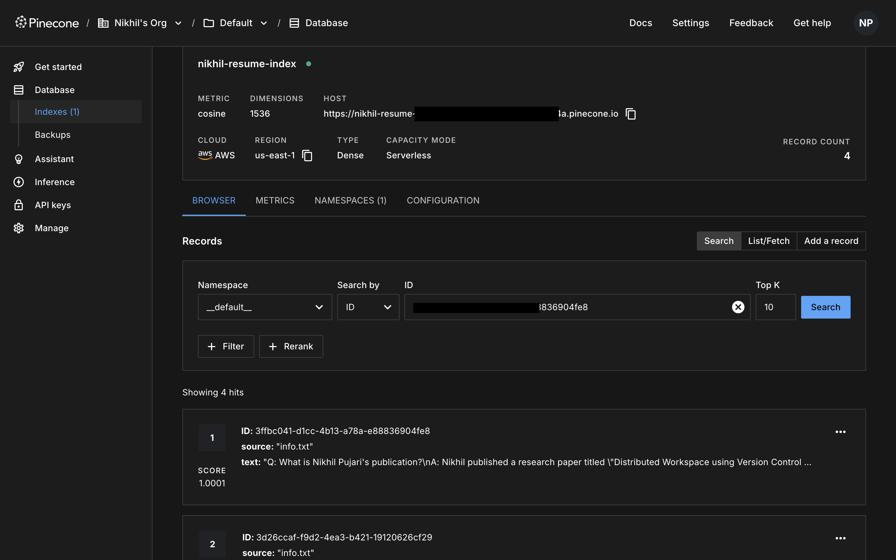

## ✅ RAG Personal Portfolio Chatbot Setup –Make Your Resume Speak

---



### 1️⃣ Clone the Project & Set Up Python Environment

```bash
git clone https://github.com/yourusername/RAG_For_Portfolio.git
cd RAG_For_Portfolio
python3 -m venv venv
source venv/bin/activate
pip install -r requirements.txt
```

---

### 2️⃣ ✅ Set Up Pinecone

**A. Create Account:**

- Go to [https://app.pinecone.io](https://app.pinecone.io)
- Create a project (choose **Starter (Free)** tier)
- Copy:

  - **API Key**
  - **Environment** (e.g., `gcp-starter`, `us-east-1`)

**B. Create Index:**

- Go to “Indexes” → **Create Index**

  - Name: `nikhil-resume-index`
  - Metric: `cosine`
  - Dimension: `1536` (for OpenAI embeddings)
  - Pods: `1 pod`, `starter tier`





---

### 3️⃣ Create a `.env` File

Add your keys:

```env
OPENAI_API_KEY=your-openai-key
PINECONE_API_KEY=your-pinecone-key
INDEX_NAME=nikhil-resume-index
```

---

### 4️⃣ Prepare Resume Data

Replace the exsisting resume and info files with yours. The info.txt file is used to save information that might not be included in your resume like visa status, salary expections etc.

---

### 5️⃣ Populate Pinecone Vectorstore

Run a script `index_resume.py` after updating the file names in the script.

```bash
python3 index_resume.py
```

---

### 6️⃣ Run the Flask Backend

```bash
python3 chat_backend.py
```

✅ You should see:

```
Running on http://0.0.0.0:5004
```

---

### 7️⃣ Plug Into the Frontend

Use the provided HTML/JS frontend. Update the JS fetch URL:

```js
fetch("https://yourdomain.com/chat", {
  method: "POST",
  headers: { "Content-Type": "application/json" },
  body: JSON.stringify({ query: userInput }),
});
```

---

### 8️⃣ Ask Questions Like:

- “What experience does [name] have with ML?”
- “Which cloud platforms has he worked with?”
- “Has he done CI/CD automation?”

---

## 🏁 You're Done!

This gives you:

- Secure backend + resume memory via Pinecone
- Clean chatbot interface for websites
- Specific resume-based answers via OpenAI
